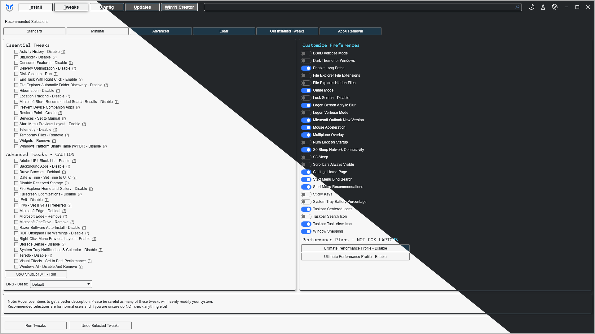

# WinUtil Screenshot Automation Proof of Concept

[](https://github.com/mewclouds/winutil-readme-ss-generation/actions/workflows/generate-screenshots.yml)

This repository is a proof of concept for automatically producing consistent,
README-ready screenshots of the [Chris Titus Tech WinUtil](https://github.com/ChrisTitusTech/winutil)
interface. It demonstrates that a GitHub-hosted Windows runner can launch the
current stable WinUtil build, control its WPF interface, capture explicit light
and dark themes, and generate a polished comparison image without manual input.

The project is independent of WinUtil and is intended as a technical demonstration
for its maintainers. It does not claim ownership of WinUtil or its visual assets.



## What the Proof of Concept Demonstrates

- Strictly identifies the real WinUtil WPF window instead of matching a terminal,
  editor, or directory name containing `winutil`.
- Opens the Tweaks tab and selects the explicit `Dark` and `Light` menu options
  through Windows UI Automation.
- Captures the WPF window directly with `PrintWindow`, without the surrounding
  desktop or terminal.
- Produces deterministic 1920x1080 captures at 100% display scaling on
  `windows-latest`.
- Crops DWM shadow padding, adds a two-pixel frame, and generates an anti-aliased
  diagonal light/dark comparison.
- Opens or updates a pull request when the final comparison image changes.
- Uploads the final comparison and diagnostics as GitHub Actions artifacts.

## Generated Files

| File | Purpose |
| --- | --- |
| `winutil-light-dark-comparison.png` | Final diagonal comparison used above. |

Raw Dark and Light captures exist only in a temporary directory while the
composite is built. `capture.log` and the failure-only `inspect_output.txt` are
workflow diagnostics; they are uploaded as artifacts but are not committed.

## Run the Automated Capture Locally

Requirements:

- Windows with WinUtil open and visible.
- An elevated PowerShell or Terminal session. WinUtil runs elevated, so the
  capture and UI Automation process must run at the same integrity level.
- [`uv`](https://docs.astral.sh/uv/) to provide Python, Pillow, and pywinauto.

Launch WinUtil from an elevated PowerShell session:

```powershell
irm https://christitus.com/win | iex
```

From an elevated terminal in this repository, run:

```powershell
uv run --with pillow --with pywinauto python automate_winutil.py
```

The automation maximizes WinUtil, opens Tweaks, captures Dark followed by Light,
generates only `winutil-light-dark-comparison.png`, and leaves the application on
the Tweaks tab in Light mode. It may move or resize the WinUtil window while
running.

## Manual Fallback

`generate_all.py` retains the original interactive workflow. It captures the
themes selected by the user and does not control WinUtil through UI Automation:

```powershell
uv run --with pillow python generate_all.py
```

Follow its prompts to select Dark and Light without moving or resizing WinUtil
between captures.

## GitHub Actions Proof of Concept

The [`Generate WinUtil screenshots`](./.github/workflows/generate-screenshots.yml)
workflow is started manually from the repository's **Actions** tab with **Run
workflow**. It checks out `master` and:

1. Starts a `windows-latest` hosted runner.
2. Changes its virtual display from 1024x768 to 1920x1080 and verifies the result.
3. Downloads and launches the current stable WinUtil script in a hidden PowerShell
   host.
4. Passes the exact versioned WinUtil WPF window handle to the Python automation.
5. Captures the raw themes in a temporary directory and generates the final
   composite in the repository.
6. Opens or updates the `automation/update-winutil-screenshot` pull request when
   the composite differs from `master`. Its generated commit is authored and
   committed by `github-actions[bot]`.
7. Uploads the composite, `capture.log`, and failure diagnostics for 14 days.

The workflow intentionally downloads the current stable WinUtil entry point rather
than pinning a WinUtil revision. That makes this useful for checking the current UI,
but means output can change when WinUtil changes even if this repository does not.
The workflow never writes directly to `master`. The repository must allow GitHub
Actions to create pull requests under **Settings > Actions > General > Workflow
permissions**. If the generated composite is unchanged, no pull request is
created.

## Configuration

| Environment variable | Use |
| --- | --- |
| `WINUTIL_CAPTURE_WIDTH` | Fixed output width. Must be set with the height. |
| `WINUTIL_CAPTURE_HEIGHT` | Fixed output height. Must be set with the width. |
| `WINUTIL_HWND` | Internal CI override containing the exact WinUtil window handle. The title and WPF class are still validated. |

Without fixed capture dimensions, local automation captures the maximized window
at the current desktop size.

## How Capture Works

- **Window lookup:** validates a title containing `WinUtil` and the WPF
  `HwndWrapper` class. Local discovery checks the current, input, and Default
  desktops. CI supplies a validated HWND to avoid hosted-desktop ambiguity.
- **DPI awareness:** enables Per-Monitor V2 awareness so Win32 bounds are physical
  pixels and are not scaled a second time.
- **UI Automation:** locates `WPFTab2BT`, `ThemeButton`, and the transient `Dark`
  and `Light` options. Real pointer input is required because the theme opener does
  not respond correctly to UIA `InvokePattern`.
- **Capture:** uses `PrintWindow(hwnd, ..., PW_RENDERFULLCONTENT)` and converts the
  resulting BGRA bitmap into a Pillow image.
- **Composition:** detects near-black DWM shadow margins, applies a two-pixel border,
  and creates the diagonal mask at four times the output resolution before Lanczos
  downsampling.

## Troubleshooting

| Symptom | Likely cause and action |
| --- | --- |
| `Could not find visible WinUtil GUI window` | Confirm WinUtil is open, visible, and fully loaded. |
| `ThemeButton` or Tweaks is unavailable | Run the script from an elevated terminal at the same integrity level as WinUtil. |
| Theme popup option is not found | Run `inspect_winutil.py` elevated and inspect `inspect_output.txt` for changed UIA names. |
| Capture is black or `PrintWindow` fails | Verify elevation and that WinUtil has finished rendering. |
| Hosted resolution is rejected | The runner video device does not support the requested mode. The proven hosted configuration is 1920x1080 at 100% scaling. |
| The screenshot still contains a scrollbar | `PrintWindow` captures the rendered viewport, not content virtualized below a scrollable panel. A complete-page image would require scroll-and-stitch automation. |

To collect the UI Automation tree manually:

```powershell
uv run --with pillow --with pywinauto python inspect_winutil.py
```

The inspector opens the theme menu as part of collecting transient controls.

## Proof-of-Concept Limitations

- Mouse-driven WPF automation depends on an interactive Windows desktop.
- UI automation identifiers can change with future WinUtil interface revisions.
- The screenshot contains only the visible scroll viewport. It does not stitch all
  Tweaks content into one image.
- Theme detection is a pixel-brightness sanity check designed for the current
  WinUtil layout, not a general-purpose theme classifier.
- Pull requests require human review and merge; automatic merging is intentionally
  out of scope for this proof of concept.
